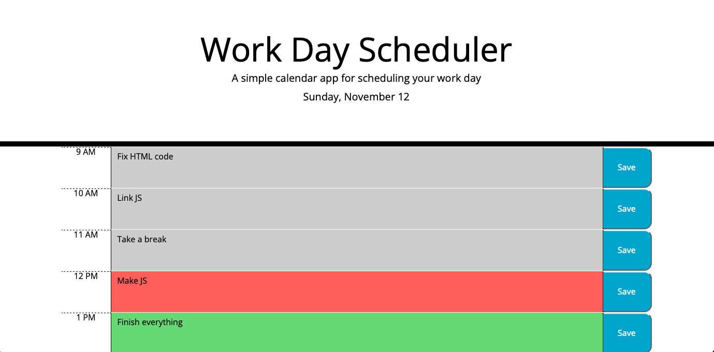
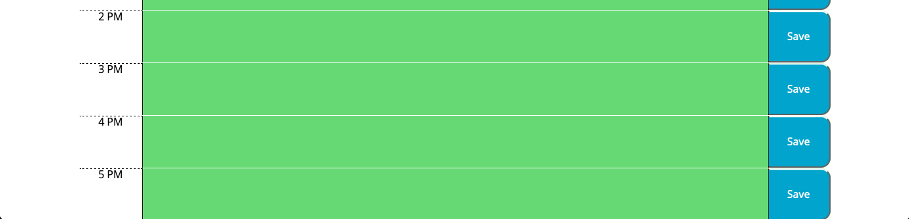

# Work*-Day*-Scheduler

## Description

As a front end developer I was tasked to create daily planner so that it is easier to follow the tasks ahead. Acceptance criteria were.

- Display the current day at the top of the calendar when a user opens the planner.

- Present timeblocks for standard business hours when the user scrolls down.

- Color-code each timeblock based on past, present, and future when the timeblock is viewed.

- Allow a user to enter an event when they click a timeblock.

- Save the event in local storage when the save button is clicked in that timeblock.

- Persist events between refreshes of a page.

Bellow you can see the images of deployed application together with links where you can access it.

Here is the screenshot of deployed application:

Deployed application: https://janeks111.github.io/Working-Day-Planner/

Repository: https://github.com/Janeks111/Working-Day-Planner

## Installation

N/A

## Usage

Fell free to use this for your personal needs.

## Credits

N/A

## License

Please refer to the LICENSE in the repo.
